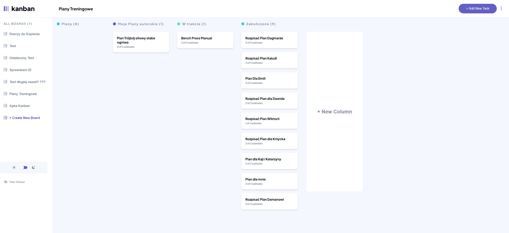

# Frontend Mentor - Kanban task management web app solution

This is a solution to the [Kanban task management web app challenge on Frontend Mentor](https://www.frontendmentor.io/challenges/kanban-task-management-web-app-wgQLt-HlbB). Frontend Mentor challenges help you improve your coding skills by building realistic projects. 

### The challenge

Users should be able to:

- View the optimal layout for the app depending on their device's screen size
- See hover states for all interactive elements on the page
- Create, read, update, and delete boards and tasks
- Receive form validations when trying to create/edit boards and tasks
- Mark subtasks as complete and move tasks between columns
- Hide/show the board sidebar
- Toggle the theme between light/dark modes
<!-- - **Bonus**: Allow users to drag and drop tasks to change their status and re-order them in a column -->
- **Bonus**: Keep track of any changes, even after refreshing the browser (`localStorage` could be used for this if you're not building out a full-stack app)
<!-- - **Bonus**: Build this project as a full-stack application -->

### Screenshot

### Links

- Solution URL: [https://github.com/Gwynbleidd222/Kanban]
- Live Site URL: [https://kanban-azure-gamma.vercel.app/]

## My process

### Built with

- [React](https://reactjs.org/) - JS library
- Flexbox
- CSS Grid
- Mobile-first workflow
- Sass

### What I learned

I learned a lot—for example, how to work with React Context and how to connect all the components together.

### Continued development

I created this app in September 2024 right after finishing a basic React course. I found the project quite challenging, but I'm glad I managed to complete it. Due to my limited experience at the time, I ended up working on it for a long time.

### Useful resources

I mostly used OpenAI for help during the early stages. However, as the app grew larger and more advanced, OpenAI's assistance became less effective, and I had to figure out how to connect the components on my own.

## Author

- Website - [Piotr Łojas](https://gwynbleidd222.github.io/Main-Single-Page-Portfolio/)
- Frontend Mentor - [@Gwynbleidd222](https://www.frontendmentor.io/profile/Gwynbleidd222)

